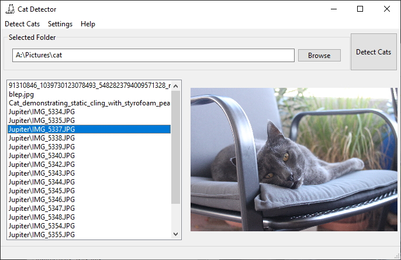

# cat-detector
 Uses a CNN to sort your photos and find cat pics!

Now with an easy to use UI
Select your image folder and click "Detect Cats" to get a list of your cat photos!

Settings:
Search Subfolders - If the program scans images in subfolders of the current directory
Hardware Acceleration - If the program will use gpu acceleration (Requires CUDA compatiable GPU)
